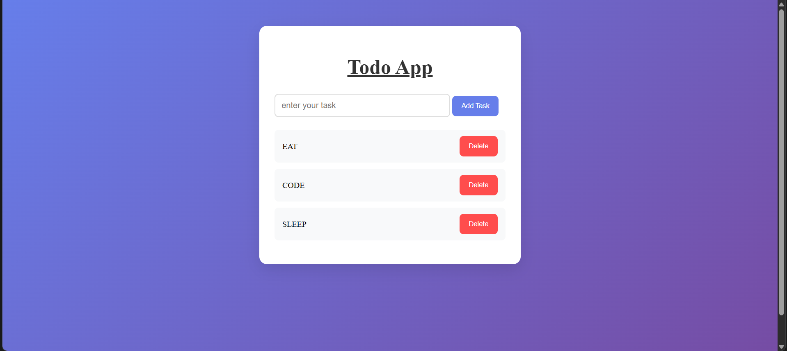

# Todo App 📝

A simple and responsive Todo App built using HTML, CSS, and JavaScript.

## Live Demo

🔗 https://mayur-thakre-7526.github.io/todo-app/

## Features

* Add new tasks
* Delete completed tasks
* Responsive design
* Clean and modern UI
* JavaScript DOM manipulation
* Event delegation implementation

## Technologies Used

* HTML5
* CSS3
* JavaScript

## Learning Outcomes

This project helped me improve my understanding of:

* DOM Manipulation
* Event Handling
* Event Delegation
* Dynamic Element Creation
* Responsive UI Design

## Author

**Mayur Thakre**

Building projects consistently and improving every day 🚀
